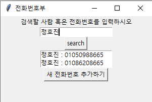
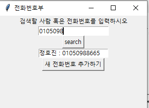
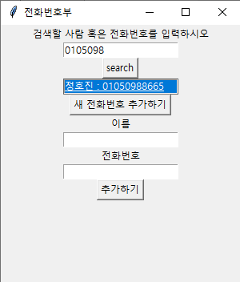
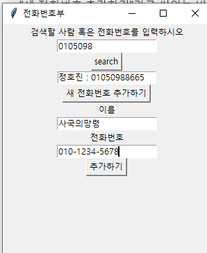
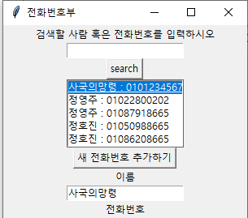
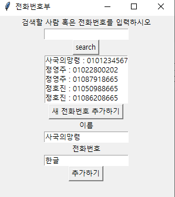
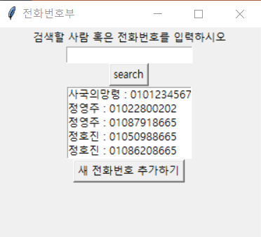

# cydf324 - 전화번호부 프로그램 설계
GitHub를 통해 소프트웨어의 업데이트 과정을 기록했다. 소스코드의 repository는 다음과 같다.
* https://github.com/froggagul/CYDF324

다음을 통해 실행할 수 있다.

```bash
pip install -r requirements.txt
python main.py
```

## 기능 설명
실행시 다음과 같이 전화번호를 관리할 수 있는 화면이 나온다.


화면은 크게 검색창, 전화번호부 표시창, 새 전화번호를 추가하는 버튼으로 구성돼있다.

### 검색창
다음과 같이 검색어를 입력하고 search 버튼을 누르면, 검색어를 바탕으로 전화번호를 검색해 결과를 보여준다.


검색어는 이름, 전화번호 등 무엇이든 가능하다.

### 전화번호 추가 버튼
"새 전화번호 추가하기"라고 써있는 버튼을 클릭하면 다음과 같이 팝업 창이 나타나는데, 이를 통해 추가할 전화번호와 전화번호를 지니는 사람의 이름을 입력할 수 있다.



이름과 번호를 입력한 뒤 추가하기 버튼을 누르면 다음과 같이 전화번호가 추가되어있다.

전화번호 형식이 아니거나, 이름이나 번호가 비어있으면 전화번호는 추가되지 않는다.


### 전화번호 보존
앱을 껐다 다시 켜도 전화번호가 보존돼있는 것을 볼 수 있다.



## 구현 방법
* 언어: python
* 라이브러리: pyqt5
* 디자인 패턴: MVC
* 데이터 저장: flat file (json)